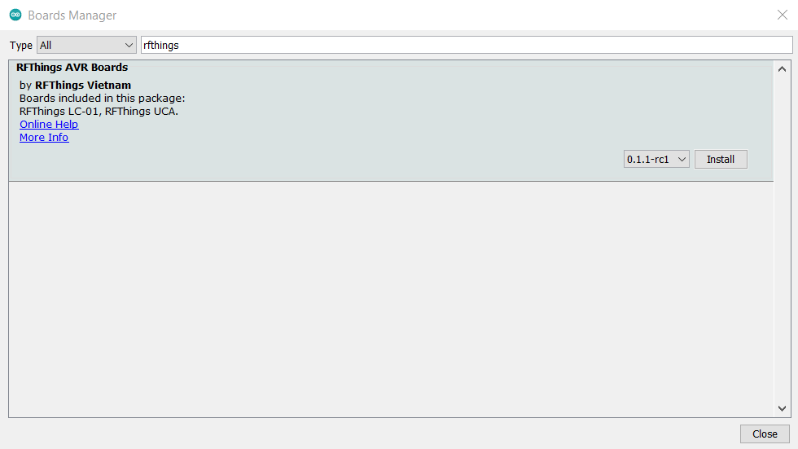
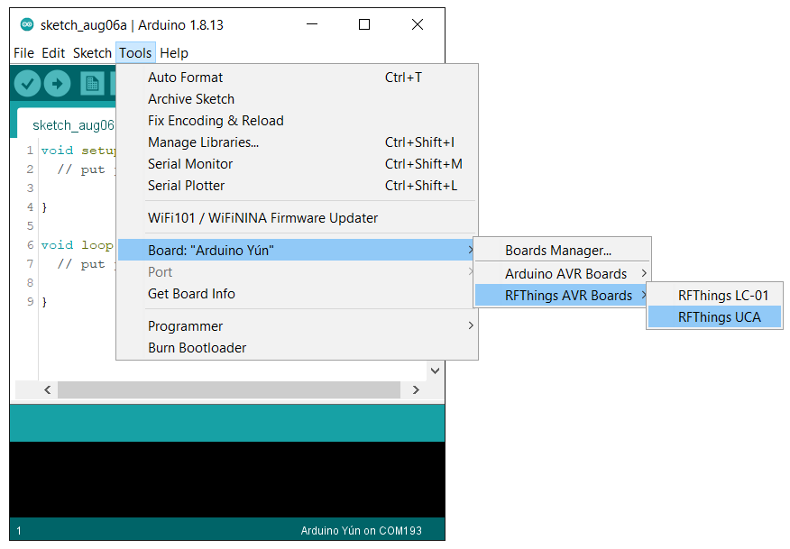

# rfthings-avr
# Arduino Core for RFThings AVR based boards

## Supported boards
### [RFThings](https://rfthings.com.vn/)
 * [RFThings-UCA](mailto:sale@rfthings.com.vn) (<b>MCU</b>: ATMega328P, <b>LoRa</b>: RFM95W, RGB LEDs <b>WS2812B</b>, Light/Temperature/Humidity Sensors)
 * [RFThings-LC01](https://rfthings.com.vn/product/rfthings-lc-01-board/) (<b>MCU</b>: ATMega328P, <b>LoRa</b>: RFM95W)

## Installing
### Board Manager
1. [Download and install the Arduino IDE](https://www.arduino.cc/en/Main/Software) (at least version v1.8.13)
2. Start the Arduino IDE
3. Go to **Preferences** *(CTRL + ,)*
4. Copy & Add the following JSON URL to your **Additional Board Manager URL**
```
https://rfthings.com.vn/wp-content/uploads/package_rfthings-avr_index.json
```
5. Open the **Boards Manager** from the **Tools -> Board** menu and install "<b>RFThings AVR Boards by RFThings Vietnam</b>"

6. Select your board from the **Tools -> Board** menu

7. Start uploading your code!

### Libraries
You can take a look at these interesting libraries for RFThings AVR based boards
* [FabienFerrero/UCA_Board](https://github.com/FabienFerrero/UCA_Board)
* [sandeepmistry/arduino-LoRa](https://github.com/sandeepmistry/arduino-LoRa)
* [adafruit/Adafruit_NeoPixel](https://github.com/adafruit/Adafruit_NeoPixel)
* [adafruit/Adafruit_SHTC3](https://github.com/adafruit/Adafruit_SHTC3)
* [ldab/KXTJ3-1057](https://github.com/ldab/KXTJ3-1057)
